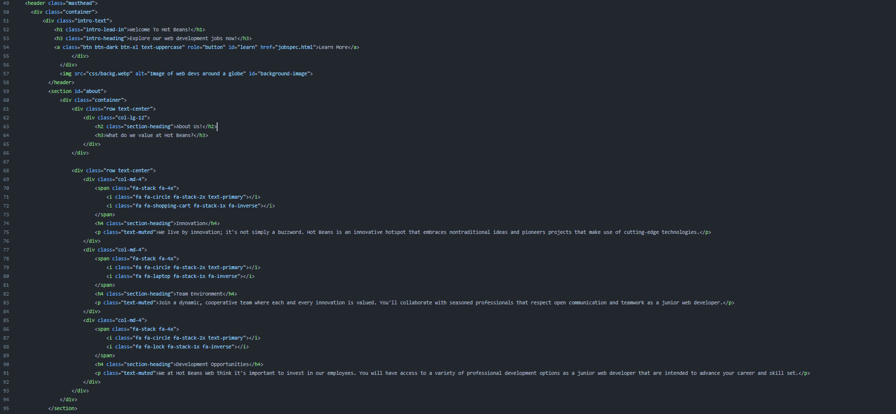

**Client Requirements**

The client requested a profile of the company itself. This area aids in establishing the company's identity and drawing clients who share its values and aspirations. It makes a good first impression and demonstrates the company's dedication to openness and transparency.

The client also requesting profiles of existing trainee web developers. Because future employees may identify with the experiences of present trainees, the company becomes more relevant and provides insights into possible career paths and organisational growth chances.

The company also requested I include job specifications and required qualifications. By ensuring that only eligible and qualified candidates apply, this information helps to save time for both the organisation and the applicants. It establishes clear expectations right away, which encourages more pertinent applications and streamlines the hiring process.

The client requested that I include an online application form for job applications. Having an online application form improves accessibility, improves user experience, and enables methodical data collecting. It makes the hiring process easier for both the employer and candidates, which improves recruitment efficiency.

The client also wanted me to include links to web development courses. By highlighting the organization's commitment to ongoing learning and development, this piece delivers value. It draws applicants who want to contribute to an innovative and improving culture by upskilling and expanding within their professions.

I am meeting the client's unique needs and assisting in recruiting quality individuals who share the company's values and vision by integrating these components into the website, which will ultimately contribute to the organization's long-term success and growth. This will also support the website's primary objective of reaching out to new developers.

**Design Justification**

I intentionally gave visibility and visual appeal top priority when creating the design. Using contrasting colours for the text and background was a crucial tactic I used to improve readability and guarantee accessibility for a wide range of users. Through adherence to colour contrast best practices, the design facilitates seamless and inclusive browsing for people with a range of visual skills. To create a clean, polished look, the colour scheme of blue, grey, black, and white was purposefully kept constant throughout the pages. 

This methodical approach creates a timeless and adaptable design that appeals to users and strengthens brand identification in addition to helping the website maintain a consistent visual identity.

My decision to use the Kaushan typeface for titles is in line with my desire to give the website a unique look. The font's vivacious and amiable qualities direct users' attention to key components, resulting in a visually captivating and unforgettable experience. Beyond aesthetics, the Kaushan font matches the general tone I want to portray effectively by fostering a feeling of warmth and approachability. 

Making sure that every page has a modern, coherent design demonstrates my dedication to providing a seamless, user-friendly experience. Maintaining uniformity in design components such as colour scheme, layout, and navigation promotes professionalism and coherence. The website's various sections are easily navigable by users, making for a pleasant and simple user experience.

**Website functionality and Compatibility** 

The website's design choices show outstanding practicality in addition to their contribution to visual appeal. The duration it takes for the largest content element to be displayed is measured by the LCP metric. The website loads rapidly, giving users a visually complete and engaging content shortly after they visit it, as seen by the LCP of 1.7 seconds. 

Maintaining user attention and lowering bounce rates require this.

FID calculates the time elapsed between a user's initial request and the website's response. A minimum FID of 19 milliseconds indicates a nearly instantaneous reaction to user input, improving the responsiveness of the website. This prompt feedback promotes positive engagement by guaranteeing a seamless and interactive user experience.

***Browser Compatibility*** 

In order to guarantee complete cross-browser compatibility, I thoroughly examined the website using Firefox, Edge, and Chrome. The testing procedure was enacted to confirm that the website functions reliably in many different browsers, giving users a seamless experience independent of their preferred browser.

 

Forms and interactive buttons are examples of functionality that has undergone comprehensive testing to ensure appropriate operation. I also looked through the console logs to see if there were any particular faults or warnings that might be peculiar to the Firefox browser.

I tested various Microsoft Edge pages and features in a manner akin to that of testing Firefox to make sure that interactive features worked as intended and that visual components were displayed appropriately.

**Visual Page Designs and Feedback**

The design sheet that I created designates certain fonts, such Kaushan Script and Inika, for use with particular website elements. This guarantees a visually pleasing and uniform typeface across the website.
The stylesheet adds to a polished and professional appearance by specifying fonts, which is consistent with the overall design.

The selected colour scheme, which consists of white, grey, and blue, is also specified in the CSS. A united and professional look is facilitated by the visually cohesive design that is produced by the continuous use of colours.
These particular colours are used for text, navbars and card elements on the website to support branding and facilitate user navigation.

**Job Specification Page**

***User Feedback***

The white of the first design is too harsh on the eye, a bit straining. The "apply now" button without a border is boring. The layout on second design is more cohesive and visually interesting.
The font makes the second design satisfying and cozy to look at.

After hearing this feedback, I made the decision to opt for the darker colour palette as it seems to be better received by users and holds the following benefits:

**Reduced Eye Strain**

Bright white backgrounds can cause eye strain, particularly when using a screen for extended periods of time. Because there is less contrast overall when the background is darker and the text is lighter, consumers can read content for longer periods of time without experiencing any discomfort. The reading experience is enhanced by the use of blue, grey and white. Users will find it simpler to concentrate on content with the well-balanced contrast created by the lighter font on a darker background.

**Aesthetic Appeal**

Darker designs often feel more refined. The mix of blue and grey hues gives the website a polished look that compliments all of the other pages and general aesthetic. The visual hierarchy can be more effectively controlled with a darker background. With a darker background, key features like headings and call-to-action buttons can stand out more, drawing users' attention and enabling better navigation.

**Application Visual Design Plan**

## Website optimization

**Before**

**After**

**Optimizations made:**

- Removed unnecessary <p</n>> </p</n>> and <br</n>> tags for cleaner code.
- Combined the "About Us" section under a single <section> with the id="about".
- Removed redundant class attributes where they were not adding value.
- Ensured consistent indentation for better code structure.
- Simplified anchor tag in the header by removing the unnecessary id attribute.
- Reorganized and simplified class structure for better readability.

**Responsibility and Self-management**

Using a Gantt chart to methodically plan the building of the website, I showed accountability and effective self-management throughout the project. Using a strategic approach, jobs were divided into manageable chunks, time requirements were estimated, and a visual timetable was created for each task. I used the Gantt chart as a guide to help me through every stage of the project. I gave each assignment a certain amount of time, so the schedule was both reasonable and well-balanced. My ability to meet deadlines within the allotted time demonstrated my excellent time management abilities, as I gave every part of the project enough attention.

I constantly showed a sense of responsibility throughout the project by setting priorities and taking the needs of the client into account at every turn. Understanding how crucial it was to match the client's vision with the finished product, I actively sought out feedback and ideas to make sure their expectations were met.

**Review**

**Optimization for client requirements**
